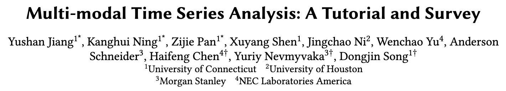
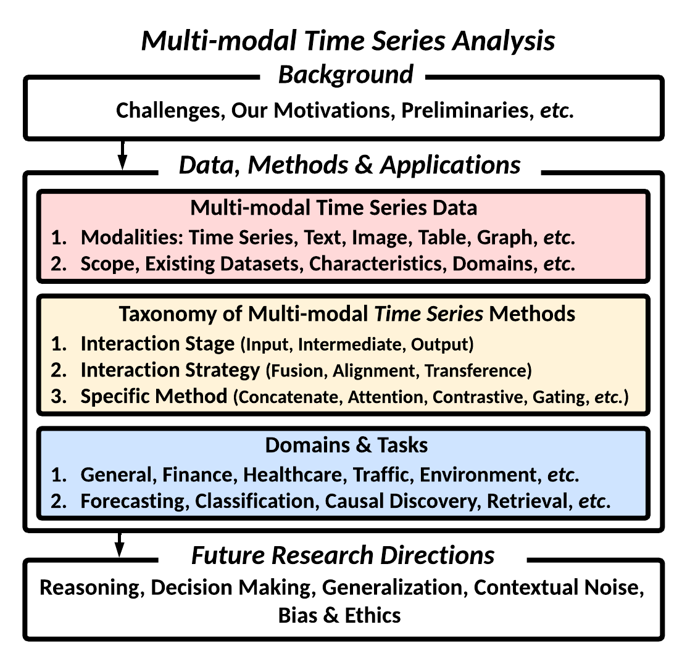
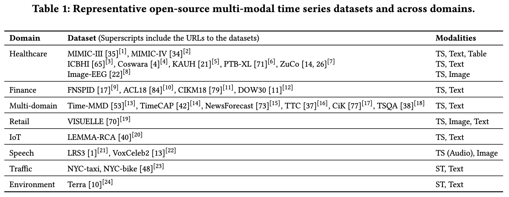
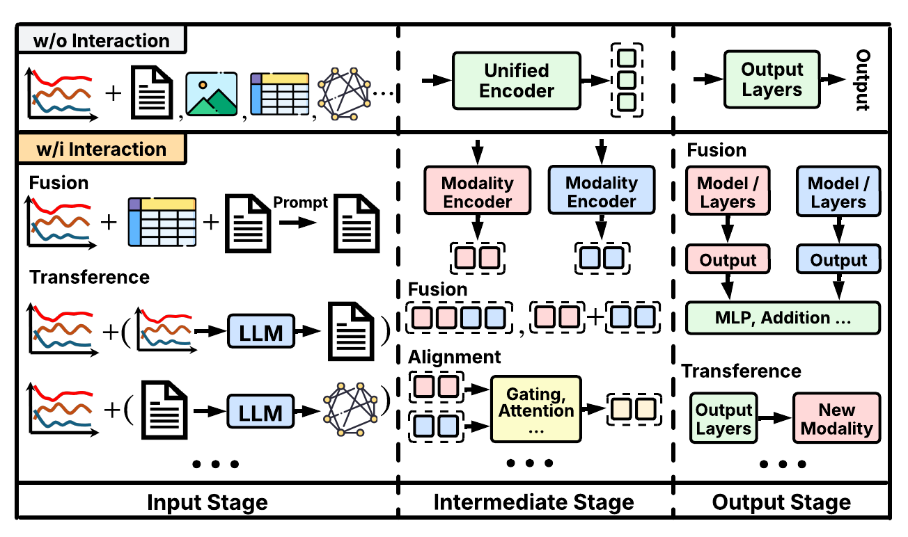
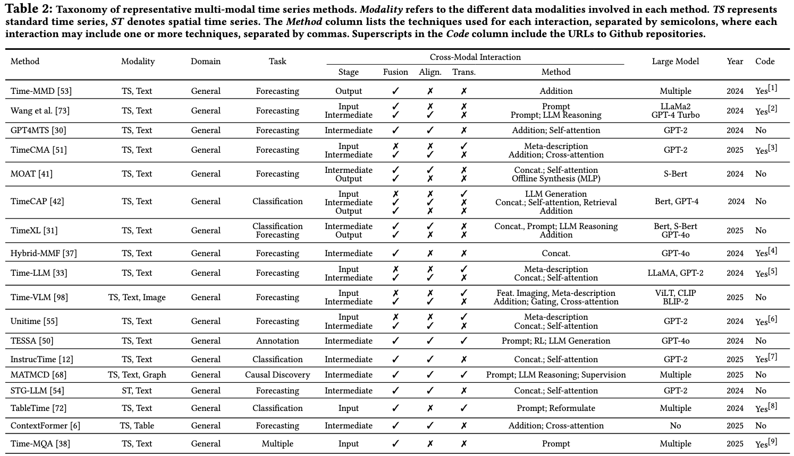
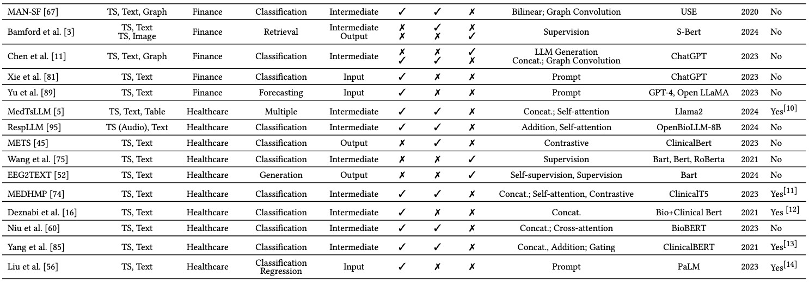
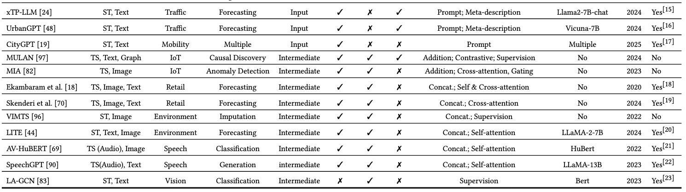

# 多模态时间序列分析 - Tutorial & Survey

---

## 1. 论文概述与资源链接

**研究背景与主要贡献**  
多模态时间序列分析（Multi-modal Time Series Analysis）是近年来数据挖掘和深度学习领域的热点方向，旨在通过整合文本、图像、结构化数据等多种模态信息来丰富时间序列建模能力。本篇教程从数据、方法和应用三个维度，对该领域进行了系统、全面且前沿的综述。论文深入探讨了医疗、金融、城市交通、零售电商等多场景下的多模态时间序列分析应用，展示了时间序列数据与文本、图像、表格等模态的联动分析如何显著提升预测与决策的准确度和可解释性，为从业者和研究者提供了系统的理论指导和实践参考。

**Arxiv 论文下载地址**  
https://arxiv.org/abs/2503.13709

**GitHub 仓库链接**  
https://github.com/UConn-DSIS/Multi-modal-Time-Series-Analysis

---

## 2. 论文结构一览

**主要章节**  
1. **背景与动机**  
   - 多模态时间序列数据的重要性  
   - 存在的关键挑战（异质性、模态对齐、噪声等）  
2. **数据与方法**  
   - 代表性开源多模态数据介绍  
3. **方法分类与对比**  
   - 不同交互方式（融合、对齐、转换）的核心思想  
   - 作者提出的统一分类体系与代表性模型分析  
4. **应用与案例**  
   - 医疗、金融、交通、零售等典型场景的最新进展  
5. **未来方向与挑战**  
   - 研究潜力：推理、决策、域泛化、可解释性、公平性等  
   - 作者对领域未来的展望

**论文结构**

---

## 3. 多模态时间序列数据概述

**1）开源数据集收录**  
- 论文中汇总了若干常用的开源多模态时间序列数据集，覆盖医疗（如MIMIC系列）、金融（如FNSPID）、IoT、交通（如NYC交通数据）等多种场景。  
- 每个数据集通常包含时间序列信号，再配合文本、图像或结构化元数据，为多模态分析提供素材。

**数据集**

---

## 4. 核心框架：Multi-modal Time Series Analysis

论文针对多模态时间序列提出了一个三大交互环节的统一框架：

1. **融合（Fusion）**  
   - 将时间序列与文本、图像等不同模态信息在输入或中间表示层面进行合并  
   - 技术手段：提示（Prompt）、拼接、注意力机制、多模型输出融合等

2. **对齐（Alignment）**  
   - 解决不同模态在时间尺度与语义层面的不一致问题  
   - 可采用自注意力、交叉注意力、图卷积、对比学习等技术手段  
   - 输入、中间、输出三个阶段均可进行对齐策略

3. **转换（Transference）**  
   - 模态间的转化或生成  
   - 举例：从数值时间序列生成文本描述，或通过生成图像表示辅助时间序列学习  
   - 适用于数据增强、跨域学习、多任务协同等场景

**核心框架**  

---

## 5. 统一分类体系 (Taxonomy)

作者基于大量文献调研，对多模态时间序列模型做了系统分类：

- **按模态分类**  
  - 包含时间序列、文本、图像、图、表格、时空序列等
- **按下游任务分类**  
  - 预测、分类、异常检测、生成等
- **按交互类型分类**  
  - 如融合（Fusion）、对齐（Alignment）、转换（Transference）
- **按交互阶段分类**  
  - 输入、中间阶段、输出
- **按应用场景分类**  
  - 通用、医疗、金融、交通、零售、IoT 等  

并列举了典型研究代表模型进行分析。

**通用领域**

**金融及医疗领域**

**其他领域**

---

## 6. 实践与应用场景

**1）医疗健康**  
- 利用EHR（电子病历）中的文本数据与生理信号（如心电、脑电）相结合，提升诊断与预测准确度  
- 文中提及某些最新研究，利用临床文本+患者时序体征的组合，显著改善住院再入院预测

**2）金融交易**  
- 将市场时间序列（股价、交易量等）与新闻文本或社交媒体信息融合，辅助趋势预测  
- 金融市场中，融合多模态信息可以更全面地评估市场情绪

**3）交通与环境**  
- 结合地理空间数据、交通流量序列与天气新闻报道，用于更精准的出行预测与区域规划  
- 环境监测中，多模态信息的整合能够有效解决数据缺失问题，提升环境时空预测的准确性

**4）零售电商与IoT**  
- 新产品上市销量预测，可结合销售历史+图文描述  
- 工业设备故障诊断，融合传感器时序与日志文本或图像监控

---

## 7. 展望与未来工作

论文在结尾部分分享了多模态时间序列分析领域仍待深入探讨的一些方向：

- **大模型与跨模态推理**：未来研究应探索在多模态时间序列中统一整合时序推理与上下文理解的框架，引入外部知识库或检索增强技术，并结合链式思维等新型推理方法，提升模型在复杂场景下的推理深度和可解释性。
- **决策支持**：利用多模态时间序列的预测信号与解释信息，可构建更加自适应、可解释、可靠的决策支持系统
- **域泛化**：针对多模态时间序列的域转移与分布变化，需要研究能够在不同域之间保持稳健性的模型方法，包括识别与保留各模态间的域不变特征，同时捕捉模态特有的差异，以应对未知目标域的挑战
- **数据质量**：多模态数据常因噪声或缺失而导致分析结果不稳。未来需要重点研究模态级的插值、降噪以及信息重要性定量评估等技术，进一步提高真实应用场景下的预测与推理性能
- **可解释性与透明度**：在医疗等对安全性与合规要求高的应用中，应明确各模态对最终预测或决策的贡献机制，帮助使用者理解与审查模型的推理过程，避免“黑箱”风险
- **隐私与伦理**：多模态数据往往更涉及个人隐私，在追求高准确度的同时，需结合公平性约束、对抗式去偏等方法，严谨评估潜在偏差并及时纠正

---

## 8. 总结与附录

**本文总结**  
多模态时间序列分析是一个前景广阔且充满挑战与机遇的交叉研究领域。本论文通过系统整合已有工作，并提出了涵盖融合、对齐、转换等交互方式的统一分析框架和分类体系，在理论与实践两个层面为研究者提供了新思路与实践指导。其应用涵盖医疗、金融、物联网、交通、零售等多场景，已有成果表明多模态数据的融合能够显著提升预测与决策的准确度和可解释性，为进一步的学术探索与产业落地奠定了坚实基础。

如需获取更多相关研究、示例代码以及数据集使用说明，可访问以上链接或在评论区留言，与我们交流探讨。

---
